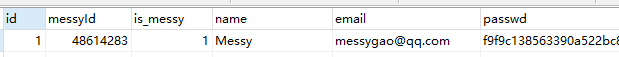

## 日常前言
项目网站：[www.messys.top](https://www.messys.top)

之前本项目被设置设为私密仓库，就只能看到每隔日一次的代码提交，自己对自己的一个star......想了想，还是觉得把项目开源出来会比较好，毕竟开源才是IT圈可持续发展的关键。

本项目UI 设计、代码实现、服务器运维、数据库设计的费用支出，均由本人一力承担。广告合作请看[关于我](https://www.messys.top/about/)文末联系方式 🙏

如果有喜欢这个项目的小伙伴，记得点一个 **star(～￣▽￣)～ ** 哦！

## 项目使用技术栈
* Css3动画、JQ、Ajax
* Python 3.x
* Django 2.x
* Mysql 8.0.x

## 功能概览
1. 基本文章展示
2. 摄影瀑布流展示（暂不支持通过管理台增加图片）
3. 关于我展示
4. 全站搜索
5. 权限系统
6. 综合管理台：
	* 服务器：
		* 资源概览
			* 服务器资源反馈：
				* CPU占用率
				* 内存占用率
				* 入网流量
				* 出网流量 
			* 站点统计（管理台）：
				* 访问IP记录
				* 单日访问量、总访问量
				* 爬虫访问量（非蜘蛛）
		* 系统操作
	* 文章管理：
		* 导入MD（App端与网页端）
	* 鸣谢管理：
		* 鸣谢人员的增删查改

## 安装步骤
1. 安装包依赖`pip installl -r requirements.txt`
2. 修改`messys/settings.example.py`配置：
	* 23行：SECRET_KEY
	* 93行：DATABASES
	* 153行：EMAIL_HOST_PASSWORD（发送邮件秘钥，选填）
3. `python manage.py collectstatic`进行静态文件搜集
4. `python manage.py makemigrations、migrate`进行数据库构建

## 管理台功能使用
>登录注册

* 先到通过导航栏的登录选项里的注册获得一个账号
	* 目前只支持用户名为Messy的用户登入，注册账号之后需进入数据修改`oauth_mul`表中的`name`字段为Messy，待优化中...
	* 
	* 
* 然后登入cms管理`127.0.0.1:8000/manager`

>系统操作


`查询归属地：`查询userip表里的ip这个字段的ip归属地，如图
`重启服务器：`
* 为了安全起见，设定是点击按钮之后五分钟后重启。
* 但我不怎么用，所以没有怎么优化，**最好不要用这个！！！**点击按钮之后会一直等到五分钟之后服务器才会返回响应（当然也可以使用加入线程的方法使其直接返回响应）
* 结束这个任务的当前唯一的方法是重启当前的web服务

>文章增加

* 由于我现在主要使用markdown写作，主要的文章样式也不想改变，所以只有导入HTML的功能
* 步骤如下：
	* 马克飞象MD写作平台 https://maxiang.io/#
	* 进行MD写作
	* 写完之后点击右上角，导出为HTML
		* 
	* 进入cms管理`127.0.0.1:8000/manager`——文章管理——导入MD即可
* 如果你不怎么会MD的语法，这里可以举几个例子
	* `# messy` == 超大号加粗messy
	* `## messy` == 大号加粗messy
	* `### messy` == 中号加粗messy
	* 上面以此类推
	* 加入代码块
		* ` ```
		def messy():
				print('messy')
		``` ` == 
		```
		def messy():
				print('messy')
		```
	* 更多方法见https://maxiang.io/#/?id=readme

## 更新日志
### 2019-04-30
1. 文章数据结构重构
2. 还有一些杂项更新

### 2019-04-22
1. 管理台使用vue-router重写结构

### 2019-04-21
1. 摄影图片的管理和展示（目前仅后端功能）

### 2019-04-18
1. 数据库结构更新

### 2019-04-17
1. 整体项目开源
2. 文章展示页再次重改（需要更多的功能）
3. 文章查询功能完善

### 2019-04-14
1. 搜索功能完善
	* localStorage记录最近搜索

### 2019-04-13
1. 搜索功能完善
* 基本搜索能力
	* 标题搜索
	* 内容搜索
* 搜索热词展示
* 记录最近搜索(空状态,待使用localStorage进行记录)

### 2019-04-12
1. 重构导航栏
2. 导航栏集成登录/注册/重置模块
2. 导航栏集成登录、注册、重置模块
3. 全站弃用bootstrap.min.css

### 2019-04-10
1. 赞赏用户展示
2. 后台管理该赞赏

### 2019-04-07
1. 管理台登录邮件通知（已弃用，阿里云需要邮件服务器）

### 2019-04-02
1. 管理台css优化页面
2. 后端文章显示杉树的self._内部元素修复

**注：**
* 对整个项目的目录结构进行优化，所以更新到git进行版本管理

### 2019-04-02
1. 文章自定义展示
2. 摄影瀑布流展示
3. 关于我展示
4. 权限系统
5. 综合管理台：
* 服务器：
	* 资源概览
	* 系统操作

* 文章管理：
	* 导入MD

**注：**
* 第一次就把网站现有的功能写出来吧，也不算changelog。
* 第一次给网站写changelog,小高兴(ﾟ▽ﾟ*) 。
